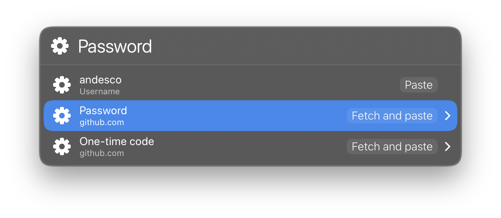

# Apple Passwords LaunchBar Action

This LaunchBar action finds Apple Passwords entries for a domain with
[`apw`](https://github.com/bendews/apw).

<div align="center">
  
</div>

## Requirements

- macOS 14 or later
- LaunchBar 6
- APW 1.1.0 or later
- supported [Chromium-based browser](https://github.com/bendews/apw#getting-started)
- Apple’s [iCloud Passwords extension](https://chromewebstore.google.com/detail/icloud-passwords/pejdijmoenmkgeppbflobdenhhabjlaj)

Install and start `apw`:

```sh
brew install bendews/homebrew-tap/apw
brew services start apw
```

## Install the action

[Download the latest release](https://github.com/andesco/launchbar-apple-passwords/releases/download/v0.5.1/Apple-Passwords-v0.5.1.lbaction.zip).
Open both actions in LaunchBar. Confirm each action:

- `Apple Passwords.lbaction`
- `Enter verification code.lbaction`

## Use

1. Type `Apple Passwords` in LaunchBar. Select the action with <kbd>Return</kbd>
   or <kbd>Space</kbd>.
2. Type a domain such as `example.com`. Press <kbd>Return</kbd>.
3. If APW finds multiple accounts, select an account. Exact-domain matches
   appear first. Subdomain and parent-domain matches appear next.
4. Select an action. Press <kbd>Return</kbd>.

<div align="center">
  
</div>

If APW needs authentication, LaunchBar shows **Enter verification code** (a
separate six-digit macOS system code, not the account's own verification
code). Press <kbd>Return</kbd>. Type the six-digit code that macOS shows.
Press <kbd>Return</kbd> again. The action continues the field you were
opening. If LaunchBar does not restore the domain result list, run the domain
lookup again.

The action does not list the full password store. It sends only the typed
domain to APW. It fetches the password or verification code only after you
choose Paste or Copy for that specific field, and only that one value —
never both together.

### Partial matching

APW can look up a complete domain or hostname. APW cannot list all saved sites or
search arbitrary text. The action stores metadata from successful complete-domain
lookups in a local index.

After you look up `example.com`, a later search for `examp` can find that domain
and its returned subdomains.

The index stores domains, usernames, titles, and availability flags. It never
stores passwords or verification codes. LaunchBar stores the index in its
Action Support folder. Partial search finds only entries from previous
complete-domain lookups. It does not search the full password store.

### Clipboard history

Pressing <kbd>Return</kbd> uses LaunchBar's paste function. LaunchBar and macOS
Spotlight do not add values pasted this way to clipboard history. Pressing
<kbd>⌘C</kbd> puts the value on the system clipboard, the same as copying text
in any other app. Clear the clipboard afterward if you do not want the value
to remain there.

## APW executable locations

The action looks for the APW executable in these locations:

- `/opt/homebrew/bin/apw`
- `/usr/local/bin/apw`
- `/opt/local/bin/apw`
- the executable returned by `/usr/bin/which apw`

## Development and releases

The `.lbaction` bundles contain the JavaScript source that LaunchBar runs. Git
tracks these bundles. Git ignores generated ZIP files. GitHub Releases contain
the ZIP files.

**Build a ZIP for the current version:**

```sh
bun run build
```

**Prepare a new version locally:**

```sh
bun run release -- 0.0.0
```

The release command:

1. Updates the version in `package.json` and both LaunchBar bundles.
2. Checks the files, runs tests, and creates the ZIP.
3. Commits the version change and creates the Git tag.

The command does not connect to GitHub. Review the commit, tag, and ZIP before
you publish.

**Publish the prepared version:**

```sh
bun run publish -- 0.0.0
```

The publish command requires an authenticated
[GitHub CLI](https://cli.github.com/). It checks the version and tag. It builds
and tests the ZIP. It pushes the branch and tag to the configured `origin`
remote. It creates or updates the GitHub Release.

Keep the working tree clean before you run `release` or `publish`.

---

This document follows the [ASD-STE100 Simplified Technical English](https://en.wikipedia.org/wiki/Simplified_Technical_English) standard.
